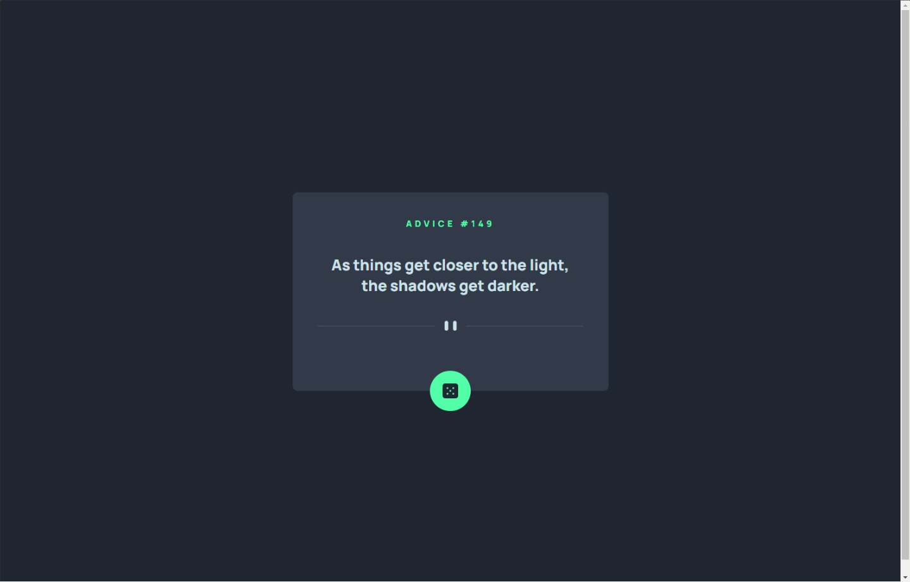
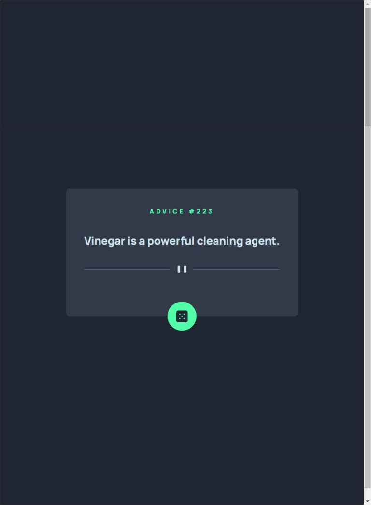
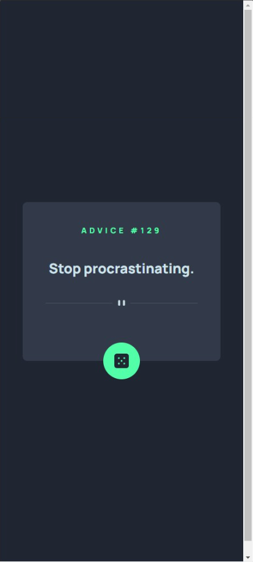
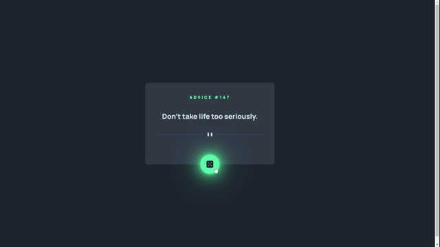

# Frontend Mentor - Calculator app

Esta é uma solução para o [Advice-generator](https://www.frontendmentor.io/challenges/advice-generator-app-QdUG-13db). Os desafios do Frontend Mentor ajudam você a melhorar suas habilidades de codificação ao construir projetos realistas.

## Resumo de conteúdos

- [Visão Geral](#Visão-Geral)
  - [O desafio](#O-desafio)
  - [Captura de tela](#Captura-de-tela)
  - [Links](#Links)
- [Meu processo](#Meu-processo)
  - [Construído com](#Constrído-com)
  - [O que eu aprendi](#O-que-eu-aprendi)
  - [Continuação dos desenvolvimentos](#Continuação-dos-desenvolvimentos)
  - [Recursos utilizados](#Recursos-utilizados)
- [Autor](#Autor)

## Visão Geral.

### O desafio

Os usuários devem ser capazes de:

- Visualizar o layout ideal para o aplicativo, dependendo do tamanho da tela do dispositivo.
- Visualizar os estados de foco para todos os elementos interativos na página.
- Gerar um novo conselho clicando no ícone de dados.

### Captura de tela

- Desktop
<p  align="center" >
  
</p>

- Tablet
<p  align="center" >

</p>

- Mobile
<p  align="center" >

</p>

- Gif
<p  align="center" >

</p>

### Links

- Solução URL: [https://github.com/michelwene/Advice-Generatorp](https://github.com/michelwene/Advice-Generator)
- Site URL: [https://michelwene.github.io/calculator-app/](https://michelwene.github.io/calculator-app/)

## Meu processo

### Construído com

- ReactJS
- Typescript
- Axios
- Styled-Components
- Design responsivo

### :bulb: O que eu aprendi
```typescript
interface CardProps {
  slip: {
    id: number;
    advice: string;
  };
}

export function Card() {
  const [advices, setAdvices] = useState<CardProps | null>();

  const setNewAdvice = async () => {
    const { data } = await api.get("advice");

    setAdvices(data);
  };

  useEffect(() => {
    setNewAdvice();

    //eslint-disable-next-line react-hooks/exhaustive-deps
  }, []);
  return (
    <Container>
      <div>
        <h1>Advice #{advices?.slip.id}</h1>
        <p>{advices?.slip.advice}</p>
        
        <button type="button" onClick={setNewAdvice}>
          
        </button>
      </div>
    </Container>

    //Neste componente contruido com typescript, eu chamei uma api responsável por trazer as frases mostradas na página, e pude colocar em prática os conceitos aprendidos em outra projetos sobre o typescript.
```

### Continuação dos desenvolvimentos

Pretendo continuar fazendo projetos do FrontendMentor, para melhorar meus conhecimentos em ReactJS e TypeScript, posteriormente, utilizar NextJS.

### Recursos utilizados

- [PerfectPixel](https://www.welldonecode.com/perfectpixel/) - Plugin do google Chrome utilizado para servir de refência na construção do layout, funciona mais ou menos como um FIGMA.
- [Developer Mozilla](https://developer.mozilla.org/en-US/docs/Web/JavaScript) - A documentação do Developer Mozilla é essencial para compreender as funções e conseguir aplicar as mesmas no projeto.
- [Advice Slip](https://api.adviceslip.com/) - Esta é uma API que eu consumi para pegar as frases de conselho. 

## Autor

- Frontend Mentor - [@michelwene](https://www.frontendmentor.io/profile/michelwene)
- Linkedin - [@michelwene](https://www.linkedin.com/in/michelwene/)
